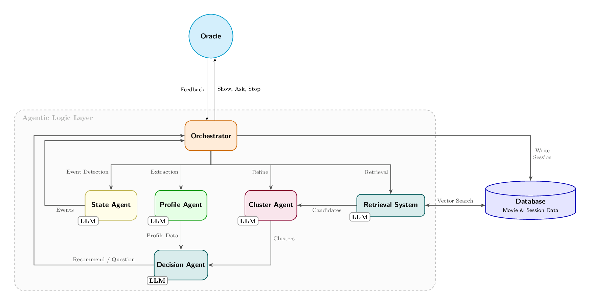
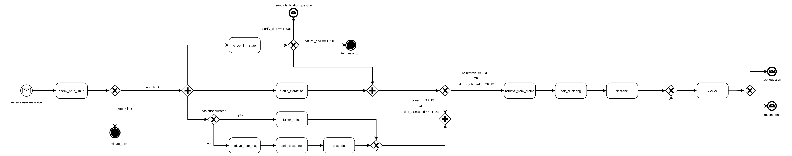

# Architecture Diagram

This diagram captures the **online conversational loop**: the **Retrieval System**, **Cluster Agent** (grouping), **Profile Agent** (preference tracking), **State Agent** (event detection), **Decision Agent** (routing and questioning), and **Orchestrator** (state & handoffs), with persistent state and vector retrieval support.

## System components

| Component | Role in system | Purpose |
|---|---|---|
| **User (Oracle)** | Oracle | The source of truth for preferences: may be a human participant or an LLM-simulated persona. Provides free-form feedback interpreted at four levels (global, cluster, point, instructional). |
| **Retrieval System** | Retrieval stage | Converts the oracle's natural language into rich hypothetical prose, embeds it, and fetches the top-K candidate films from the vector store. Has two entry points: one for raw oracle utterances (first turn and proceed path) and one for profile summaries (drift and re-retrieve path). Returns enriched film metadata (synopsis, genre, director) for downstream agents. |
| **Cluster Agent** | Grouping & labelling | Operates in two modes. On a fresh candidate pool it runs dimensionality reduction followed by soft clustering, then names each group via a separate LLM pass. When prior clusters exist, an LLM-based refinement step updates boundaries, scores, and membership based on the oracle's latest reply. In both modes the output is a set of named clusters with per-film soft-assignment scores. Never writes to session state directly. |
| **Profile Agent** | Preference extraction | Maintains a structured representation of the oracle's evolving taste across four fields: hard constraints, soft preferences, attitudes, and a prose summary. Also tracks excluded and seen films, which are injected into retrieval to prevent re-recommending titles the oracle has rejected or already seen. |
| **State Agent** | Event detection | Detects conversation-level events before the main pipeline runs. Hard limits (max turns, cost) are checked synchronously; an LLM call then classifies the oracle's message as one of: proceed, natural end, drift clarification needed, drift confirmed, drift dismissed, or re-retrieve. When a terminal event is detected, the rest of the pipeline is discarded and the orchestrator takes the appropriate bypass path. |
| **Decision Agent** | Routing & convergence | Scores clusters for relevance against the oracle's query, then computes entropy across the soft-score distribution as a signal of how uncertain the best choice is. An LLM call uses these signals together with the preference profile and prior questions to decide: **recommend** if one cluster dominates, or **continue** if entropy is high. When continuing, the question is generated in the same LLM call — open-ended early in a session, targeted and binary once clusters have diverged. |
| **Orchestrator** | State management & handoffs | Maintains conversation state across the full session and coordinates agent handoffs. On each turn it runs a parallel wave — state gate, profile extraction, and speculative retrieval or cluster refinement — then routes based on the state verdict. It is the sole writer to the database. |
| **Vector Database** | Persistent memory | Stores catalogue embeddings, session history, clusters, soft assignments, and oracle feedback. Supports both live retrieval and offline replay and analysis. |

## Agent Tools

Each agent operates through a well-defined tool interface. Tools are the only mechanism by which agents read from or write to external systems.

| Agent | Tool | Description |
|---|---|---|
| **Retrieval System** | `query_reformulator` | Expands the oracle's query or profile summary into hypothetical film-synopsis prose for embedding. |
| **Retrieval System** | `vector_search` | Queries the vector store for the top-K films by cosine similarity to the reformulated query. Accepts an exclusion list pushed into the SQL filter before the limit is applied. |
| **Retrieval System** | `metadata_fetcher` | Retrieves synopsis, genre, director, and rating metadata for each candidate to pass downstream. |
| **Cluster Agent** | `embedding_fetcher` | Fetches stored embeddings for the retrieved candidate IDs from the database. |
| **Cluster Agent** | `soft_cluster_engine` | Runs UMAP dimensionality reduction followed by HDBSCAN to produce per-film soft-membership scores across clusters. |
| **Cluster Agent** | `cluster_describer` | LLM tool that analyses cluster commonalities (top titles, genres, sample overviews) and returns an evocative name and short description for each cluster. |
| **Cluster Agent** | `cluster_refiner` | LLM tool that updates prior cluster boundaries, scores, and membership in light of the oracle's latest reply, without running a fresh embedding pass. |
| **Decision Agent** | `relevance_scorer` | Compares the oracle's query against cluster names and descriptions to produce a per-cluster relevance score. |
| **Decision Agent** | `entropy_calculator` | Measures spread across the cluster soft-score distribution; high entropy signals that further questioning is warranted. |
| **Profile Agent** | `profile_merger` | LLM tool that merges the oracle's latest message into the structured preference profile, updating constraints, preferences, attitudes, and the prose summary. |
| **State Agent** | `check_hard_limits` | Synchronous check for turn count and cost budget exhaustion; trips before any LLM work is scheduled. |
| **State Agent** | `check_session_state` | LLM tool that classifies the oracle's message against session state, detecting natural ends, preference contradictions, and re-retrieve triggers. |

## Turn Handling

Each oracle message is handled by a fresh `TurnRunner` that loads the `TurnContext` from the database, and then it's discarded after the turn completes. The sequence has distinct phases with routing gates in between, as illustrated in the BPMN diagram below.

### Phase 1 — Hard limit gate (synchronous)

Before any LLM work is scheduled, `check_hard_limits` evaluates turn count and cost budget against the session config. This check is synchronous and cheap. If either limit is reached the orchestrator retrieves the last recommendation from history and returns a terminal `terminate` turn — no further tasks are spawned.

### Phase 2 — Parallel understanding wave

Three `asyncio` tasks are created simultaneously:

| Task | What it does |
|---|---|
| **State gate** | LLM call: classifies the oracle's message against session history. Returns one of: `proceed`, `natural_end`, `clarify_drift`, `drift_confirmed`, `drift_dismissed`, `re_retrieve`. |
| **Profile extraction** | LLM call: merges the oracle's message into the structured preference profile (constraints, soft preferences, attitudes, prose summary, anchor films, seen films). |
| **Speculative branch** | If `prior_clustered` exists: `cluster_agent.refine` over the prior cluster set. Otherwise: `retrieve_from_message → soft_cluster (thread) → describe`. Runs entirely in parallel with the other two tasks. |

### Phase 3 — State gate verdict (first routing gate)

The state gate result is awaited first. Its verdict drives the first branch:

- **`natural_end`** — all background tasks are discarded (failures swallowed so the bypass always completes), the orchestrator retrieves the last recommendation, persists a `natural_end` turn, and returns.
- **`clarify_drift`** — same discard, but returns a drift-clarification turn instead.
- **Any other verdict** — the profile task is awaited next, completing the understanding wave.

If the state gate itself fails, sibling tasks (profile and speculative) are cancelled before the error propagates.

### Phase 4 — Cluster resolution (second routing gate)

Once both state gate and profile extraction have completed, cluster resolution picks the cluster list for this turn:

- **`proceed` / `drift_dismissed`** — the speculative branch result is consumed as-is. It has been running in parallel since Phase 3 and is ready (or near-ready) at this point.
- **`drift_confirmed` / `re_retrieve`** — the speculative branch is cancelled, and a fresh retrieval is performed using the updated profile summary as the query. The exclusion list is built from `prior_seen` plus any anchor films the profile agent extracted. After retrieval: `soft_cluster (thread) → describe`.

If the resolved cluster list is **empty** (retrieval or HDBSCAN yielded no candidates) the orchestrator returns an early-clarification turn without entering the decision phase.

### Phase 5 — Finalization (sequential)

With a non-empty cluster list, the turn enters the finalization sequence:

1. **Placeholder persist** — a turn row and a cluster snapshot are written to the database immediately, before the decision agent runs, so the session state is durable even if the decision LLM call fails.
2. **Decision agent** — scores each cluster for relevance against the oracle's query, computes entropy across the soft-score distribution, and makes an LLM call that produces either `ask` (high entropy, continue) or `show` (one cluster dominates).
3. **Reply construction**:
   - `ask` — the decision agent's question text is returned verbatim.
   - `show` — the best cluster is identified by id (falling back to the first cluster)
4. **Final persist** — the turn row is updated with the reply text and step type, and the merged preference profile is written. The seen-films merge deduplicates `prior_seen ++ anchor_films ++ seen_films` in order.
5. **Return** — a response is assembled and returned to the HTTP router.
